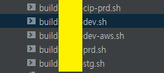
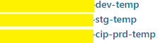
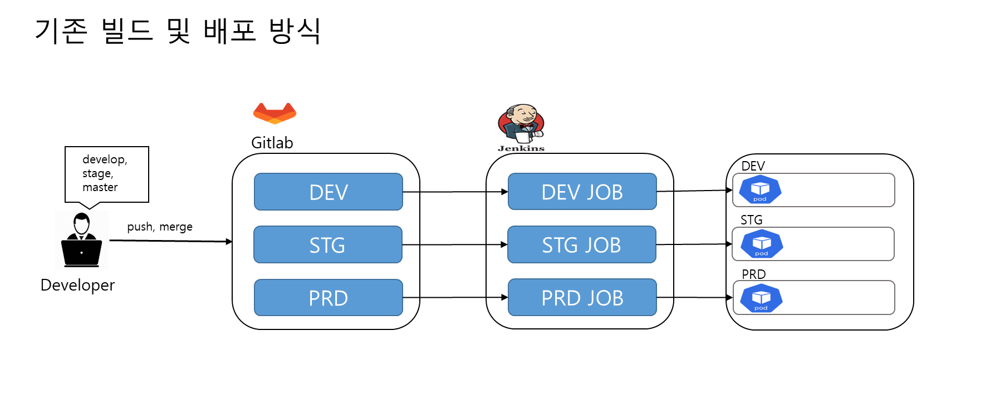
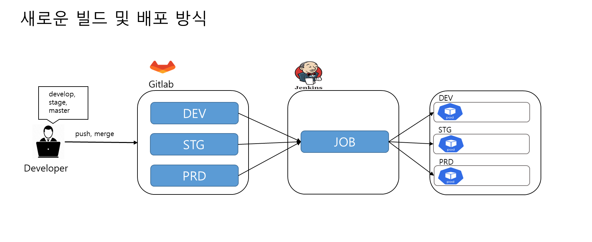
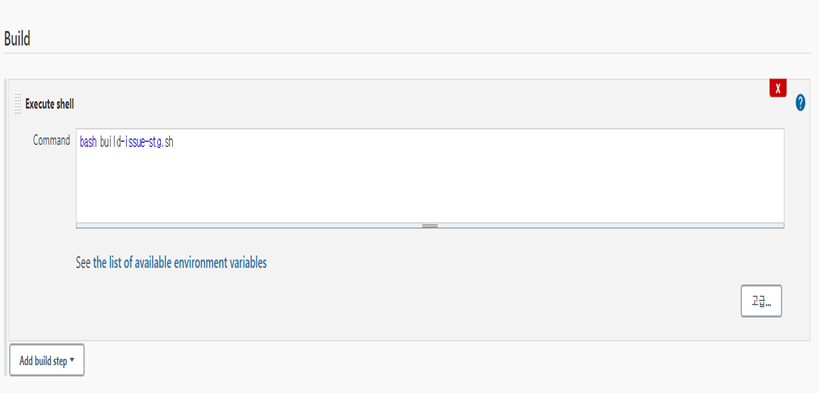
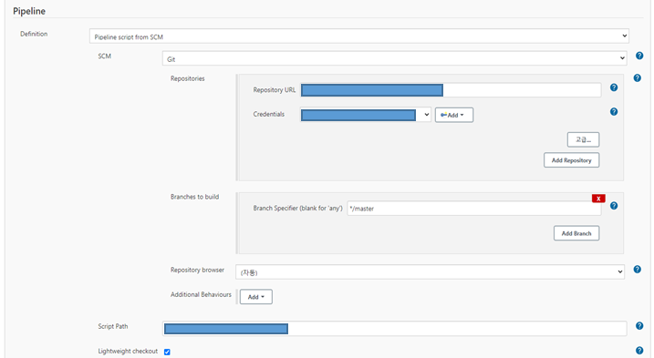
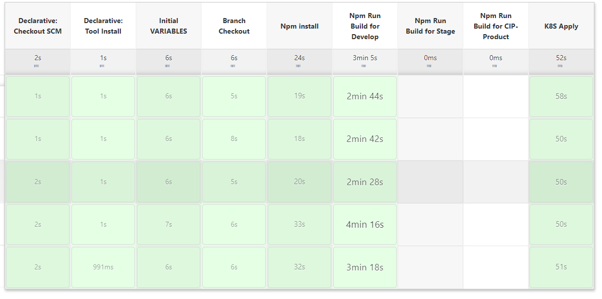
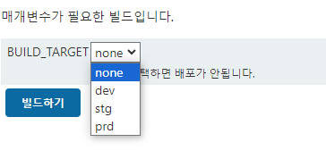

import BrowserWindow from '@site/src/components/BrowserWindow';

## 도입
---

이직 후 점점 적응을 하고, 개발을 하면서 현 회사의 환경에 익숙해 지는 과정에서 새로운 개발 환경을 구성하는 업무를 
담당하게 되었고, 업무를 수행하는 과정에서 눈에 거슬리는게 있었다.





바로 서버 별로있는 Jenkins Job들과 Source안에 SH 파일(shell script)가 있다는 것이였다.

전 회사에서 심심할 때 CI/CD를 개선하는 작업을 했던 나에게 뭔가 결심을 하게 만들었다.

<!--truncate-->

## 본론

새로운 개발 환경 서버를 추가하는 업무를 하는 과정에서 서버를 구성하고 CI/CD를 설정하기 위해서는 먼저 기존의 CI/CD 프로세스를 분석해야 했다. 

### 기존 CI/CD 방식

기존의 빌드 방식을 간단하게 글로 작성하면 개발자가 Gitlab에 push를 하면 `webhook`을 통해 `jenkins`에서 빌드하고 k8s에 
배포하는 방식으로 CI/CD가 구성되어 있었다.



간단하게 기존 CI/CD 프로세스를 이미지화 하면 위와 같다.

서버를 추가하기 위해 거의 동일한 내용의 `shell scriprt`, `webhook`, `jenkins job` 등을 추가 해야 했다.

:::info
* STG 서버를 추가하면서 내가 작업 했던 업무 리스트
  1. `STG Pod` 배포
  2. 빌드를 위한 `Shell Script` 작성
  3. `Webhook` 추가
  4. `Jenkins Job` 추가
:::

`STG` 서버 추가 작업을 할 때는 일단 기존의 방식대로 작업을 했다.

그러나 평소 `DevOps`에 관심이 있던 나는 이게 최선일까? 라는 생각을 하게 되었고
시간이 남을 때, 조금씩 CI/CD 프로세스를 수정을 하고자 했다.

먼저 개선에 앞서 기존 방식의 문제점을 생각했다.

#### 기존 CI/CD 문제점

내가 생각한 기존 CI/CD의 문제점은 다음과 같다.

1. 서버 환경이 N개로 늘어나면 N개의 `sh file`, `jenkins job`이 필요하다.
2. `sh file`이 FE Source와 함께 관리 된다.
3. Jenkins 에서는 `sh`를 실행 시켜주는 역할만 한다.
4. 어느 과정에서 실패 했는지 파악하기 어렵다.

이러한 문제점을 해결 하기위해 내가 생각한 방향성은 다음과 같다.

#### 개선하고자 하는 방향

1. `shell scirpt`을 `FE source`에서 제거하고, 별도의 Repository에서 관리한다.  
2. `Jenkins Job`을 하나로 여러 환경으로 빌드 및 배포를 진행한다.
3. 어느 과정에서 실패 했는지 추적이 쉽게한다.

### 새로운 CI/CD 방식



> 새롭게 개선하고자 하는 CI/CD 프로세스 이미지

위 이미지 처럼 여러개의 브랜치에서 Webhook을 통해 이벤트가 발생하면 하나의 jenkins Job에서 빌드를 하고, 
그리고 배포하고자 하는 서버로 자동으로 배포가 되게 수정을 하고자 했다.

그러기 위해서는 여러가지 수정을 해야 했는데 먼저 빌드 파일이 FE source와 함께 관리되고, **Jenkins**에서는 단순히 `shell sciprt`만 실행 시켜주는 빌드 방식을 변경하고자 했고, 
그 결과 **groovy script**를 작성했다.

#### 1. Groovy script 작성
나는 Groovy 문법을 잘 모르지만 최대한 **document**를 참고하면서 작성을 했다.
먼저 기존에는 브랜치(배포하려는 서버)와 `Jenkins Job`의 관계가 1:1 여서 새로운 환경이 추가 될 때마다
롭게 추가해줘야하는 방식이였다면 N(배포하려는 서버) : 1(Jenkins Job) 관계를 갖게 하려고 작업을 했다.

```groovy
package cip

pipeline {
  agent any
  tools {
    nodejs 'NodeJs-14.13.1'
  }
  stages {
    stage('Initial VARIABLES') {
      steps {
        script {
          CHOISE_BUILD_TARGET="${params.BUILD_TARGET}"
          BUILD_TARGET='""'
          BRANCH_NAME=env.gitlabBranch
          echo "BRANCH_NAME1: ${BRANCH_NAME} "
          REPO_URL='[GIT_FE_SOURCE_REPOSITORY_URL]'
          // 수동으로 배포 했을 때, 브랜치와 빌드 타겟을 정해주기 위한 조건문
          if(CHOISE_BUILD_TARGET) {
            if(CHOISE_BUILD_TARGET=='dev'){
              BRANCH_NAME="develop"
            }else if(CHOISE_BUILD_TARGET =='stg'){
              BRANCH_NAME="stage"
              BUILD_TARGET="-stg"
            } else if(CHOISE_BUILD_TARGET =='prd') {
              BRANCH_NAME="master"
            }
          }
          if(BRANCH_NAME == 'stage') {
            BUILD_TARGET= '-stg'
          } else if(BRANCH_NAME == 'master'){
            BUILD_TARGET= '-prd'
          }
          ADMIN_POD=[DEPLOY_ADMIN_POD_NAME]
          CLIENT_POD=[DEPLOY_CLIENT_POD_NAME]
          DIRECTORY='./dist/js'
          sh "echo '${BUILD_TARGET}'"
          echo "Build Target: ${BUILD_TARGET}"
          echo "BRANCH_NAME: ${BRANCH_NAME} "
        }
      }
    }
    stage("Branch Checkout") {
      steps{
        checkout([$class: 'GitSCM', branches: [[name: BRANCH_NAME]], doGenerateSubmoduleConfigurations: false, extensions: [], submoduleCfg: [], userRemoteConfigs: [[credentialsId: CREDENTIALS_ID, url: REPO_URL]]])
      }
    }
    stage("Npm install") {
      steps{
        sh 'npm install'
      }
    }
    stage('Npm Run Build  for Develop') {
      when {
        expression {
          return BRANCH_NAME=='develop'
        }
      }
      steps {
        sh 'npm run build_dev'
      }
    }
    stage('Npm Run Build  for Stage') {
      when {
        expression {
          return BRANCH_NAME=='stage'
        }
      }
      steps {
        sh 'npm run build_stg'
      }
    }
    stage('Npm Run Build  for CIP-Product') {
      when {
        expression {
          return BRANCH_NAME=='master'
        }
      }
      steps {
        sh 'npm run build_cip_prd'
      }
    }
    stage('K8S Apply') {
      steps {
        echo '===========================\n'
        echo 'Build cp ADMIN'
        echo '===========================\n'
        sh "kubectl exec ${ADMIN_POD} -n [TARGET_POD_NAMESPACE] --kubeconfig=[KUBE_CONFIG_PATH] --context=[CONTEXT] -- sh -c 'rm -rf /usr/share/nginx/html/admin/dist'"
        sh "kubectl cp ${WORKSPACE}/dist  saas/${ADMIN_POD}:/usr/share/nginx/html/admin --kubeconfig=[KUBE_CONFIG_PATH] --context=[CONTEXT]"

        echo '===========================\n'
        echo 'Build cp Client'
        echo '===========================\n'

        sh "kubectl exec ${CLIENT_POD} -n TARGET_POD_NAMESPACE] --kubeconfig=[KUBE_CONFIG_PATH] --context=[CONTEXT] -- sh -c 'rm -rf /usr/share/nginx/html/client/dist'"
        sh "kubectl cp ${WORKSPACE}/dist  saas/${CLIENT_POD}:/usr/share/nginx/html/client --kubeconfig=[KUBE_CONFIG_PATH] --context=[CONTEXT]"
      }
    }
  }
}

```

> 해당 스크립트에 대한 자세한 설명은 생략한다. 

**Jenkins Multibranch Pipeline** 를 활용을 했다면 브랜치 관련해서 문법이 더 간단 했겠지만 버전 문제로 사용하지 못 했다.
또한 팀원들의 요청으로 수동 배포 방식도 가능하게 작성했다.

그리고 `groovy script`는 별도의 Repository에서 관리를 하는 방식으로 변경했다.

:::info
Groovy 문법 관련해서는 공식 도큐먼트를 참고하자.  
[Jenkins Pipeline groovy](https://www.jenkins.io/doc/pipeline/steps/workflow-cps/#pipeline-groovy)
:::

#### 2. Jenkins 구성 변경

기존에는 Jenkins에서 sh 파일을 실행 시키는 방식으로만 사용 했지만 새롭게 개선한 방향으로는
별도의 Repository에서 groovy script를 읽고 빌드 및 배포를 진행하고자 해서 jenkins job의 구성을 변경했다.



> 기존에는 Jenkins 구성은 단지 checkout 받은 소스에서 sh 파일을 실행시켜주는 역할만 했다.



> 빌드 파일 스크립트를 별도의 Repository에서 관리, 파이프라인 방식으로 변경

#### 3. CI/CD 과정 한눈에 보기



파이프라인을 이용하고, groovy script에서 stage 기준으로 단계를 정의 했기 때문에 위 이미지 처럼 어느 단계에서 실패 했는지
보다 확인하기 쉽게 개선을 했다.

#### 4. 팀원들의 요구사항 수동 배포 설정



그리고 팀원들의 요구 사항인 webhook을 통한 배포 외에도 직접 배포할 서버를 선택해서 수동으로 배포할 수 있는 방법으로는 
jenkins의 Choice Parameter를 활용해서 적용했다.


## 결론

음.. 2 ~ 3일이 소요되는 작업이였고, 그 과정에서 Jenkins version 문제와 groovy 문법을 정확히 몰라서 많은 트러블이 있었고,
해결해나가는 과정에서 조금 성장했다고 생각한다.

또한, 내가 한 방법이 정답이라고는 생각하지 않는다. 분명 내가 한 방법은 비 효율적일수도 있다. 
하지만 어떻게 하면 내가 더 개발에 집중하고, 더 나아가 같이 일하는 동료들이 개발에 더 집중할수 있는 시간이 조금이라고 향상되었다면
그걸로 만족한다.

그리고 코드리뷰 시간에 이러한 내용을 정리해서 리뷰를 하였고, 팀원들은 긍정적인 반응을 보여줬다.

또한 이 글을 읽는 독자가 조금이라도 DevOps 쪽에 흥미를 갖고, 기존 시스템을 개선하는 계기가 되었으면 한다.

기회가 된다면 다양한 개선 방법에 대해 공부하고 적용해보고 싶다.


