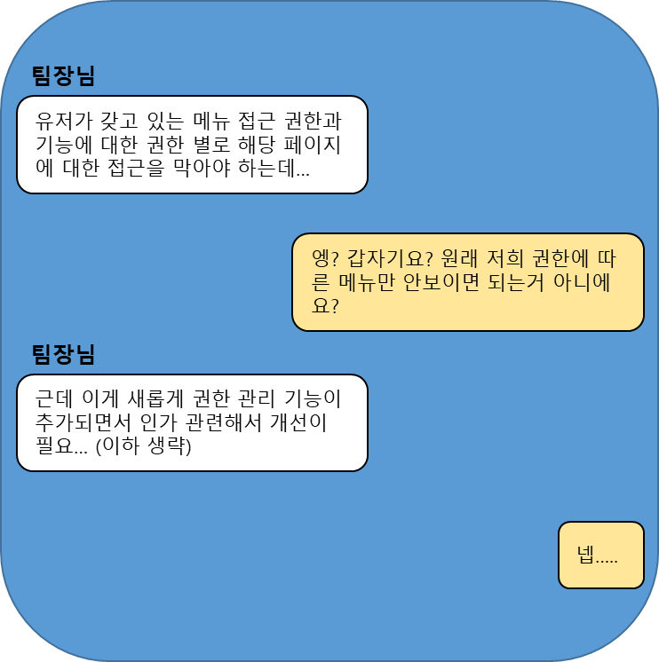

## 도입


> 제가 유리하게 편집한 내용입니다. 😉

이직 후 n개월 차. 누군가 나에게 보낸 경고장이다.

<!--truncate-->

원래 기존의 이슈리포터에는 일반 사용자, 운영자로 만 나뉘고 url도 분리가 되어 있었지만, 스프린트를 진행하면서 일반 사용자 별로 볼 수 있는
메뉴와 사용할 수 있는 기능이 다른 권한이라는 기능이 추가 되면서, 해당 페이지에 대한 권한(인가)가 없으면 접근이 불가능하게 개발을 해야하는 상황
이 발생하였다.

이슈리포터에는 이미 수 많은 페이지와 컴포넌트가 존재 했는데 이 작업을 모든 컴포넌트 각각 API를 호출하고, 핸들링 해주기에는 상당히 귀찮은 작업이
예상 되었다. 

팀장님에게 도전장을 받은 나는 이러한 상황에서 어떻게 하면 가장 효율적일지 고민을 했다.


## 본론

먼저, 이슈리포터에 어떤 인가방법을 적용할지에 대한 고민을하기 위해 필요한 이슈리포터의 버전 스펙이다.

| 이름  | 버전     |
|-----|--------|
| Vue | 2.6.14 |
| vue-router | 3.2.0  |

> 필요한 버전 정보만 적었습니다.

그리고 내가 생각해낸 방법 리스트는 아래와 같다.

1. Vue-router의 `navigation-guards`를 활용한 페이지 이동
2. 각 컴포넌트 마다 `mounted`에서 권한 체크 후, 페이지 이동 
3. 처음부터 권한(인가)에 대한 고려를 안했으니, 팀장님이 알아서 하라고 업무 거부하기(?)
4. 다른 FE 개발자분에게 떠넘기기(?)
5. HOC(고차 컴포넌트)를 활용하여 권한 체크 후, 페이지 이동

고민한 결과 HOC(고차 컴포넌트)를 사용하여 인가 로직을 추가하기로 결정하였다.

:::warning
최고이자 최선의 방법이 아닐 수 있습니다.
:::

### Why? HOC & What HOC? 🤔

왜 HOC를 선택했는지에 대해 설명하기 전에 HOC가 무엇인지 알아보자.

#### 왜 HOC 선택 했을까?

사실 가장 먼저 생각한 방법은 `vue-router`에서 구현되어 있는 `navigation-guards`를 활용하는 방법이였다.
뷰 라우터에는 전역 네비게이션 가드와 컴포넌트 내부의 네비게이션가드를 제공해준다.

하지만 전역적으로 적용하기에는 이미 기존에 사용중이던 로직과 API 설계상 네베게이션 가드 로직이 너무 복잡해 질 우려가 있어서
포기하였다. 

또한 각각의 컴포넌트 내부에 적용하는 방법으로는 너무 귀찮(?)을거 같다는 생각이 들었다.

두 번째, 각 컴포넌트 마다 적용하기 또한 유지보수(라고 쓰고 귀찮다는) 측면에서 불리하다고 생각하였다.

3번 4번 방법은 음..... 

그래서 최종적으로 생각한 방법은 `HOC` 사용하여 구현하는 방법이 였다. 

#### 이유
내가 `HOC` 선택한 이유는 router에서 path 마다 component를 연결 해 주는 곳에서 `HOC(실제 컴포넌트, 권한)` 이런식으로 하게 되면 한 곳에서만 
작업을 하면 되고, `HOC` 컴포넌트 내부에서는 권한 체크 로직을 추가하면 되기 때문에 유지 보수 측면에서 유리하다고 생각되서 선택을 하게 되었다. 

그럼 HOC에 대해 알아보자!

:::info
[navigation-guards(vue-router)](https://router.vuejs.org/guide/advanced/navigation-guards.html)
:::

#### Higher-Order Component (HOC) 란
**Higher-Order Component (HOC)**는 함수를 받아 컴포넌트를 반환하는 패턴으로 주로 컴포넌트 간의 로직을 재사용하거나 공통 기능을 주입하기 위해 사용됩니다.

HOC는 컴포넌트를 인자로 받아 그 컴포넌트를 확장하거나 변형하여 새로운 컴포넌트를 반환하는 함수

예를 들어, 다음은 로깅을 추가하는 간단한 HOC의 예시입니다:
```js
// 로깅을 추가하는 HOC
function withLogging(WrappedComponent) {
  return {
    mounted() {
      console.log('Component is mounted');
    },
    render(h) {
      return h(WrappedComponent, {
        on: this.$listeners,
        attrs: this.$attrs,
      });
    },
  };
}

// HOC를 사용하여 컴포넌트 확장
const EnhancedComponent = withLogging(BaseComponent);

```

> 고맙다. AI 민수야.(ChatGPT)

요즘 개발 할 때, 필수인 ChatGPT님의 HOC 설명이다. 위 예시를 보면 파라미터로 기존에 컴포넌트를 받아서, 어떠한 로직을 추가하거나 변경해서 
새로운 컴포넌트를 되돌려주는 방법이다.!


> 참고로 이 블로그를 만든 docusaurus도 이러한 개념을 이용해서 커스텀이 가능하다!
> (글을 작성하면서 생각한건데 디자인 패턴 중하나인 Factory Pattern과 유사한거 같기도 하고.?)

### 개발 과정

#### 고차 컴포넌트 구현하기

먼저, 내가 기존의 HOC 처럼, 컴포넌트(`baseComponent`)를 주입받고, 해당 컴포넌트를 접근(이용)하기 위해서 필요한 권한(`authorities`)을
파라미터로 주입 받는다. 

그 후, 주입 받은 권한을 서버에 요청을하면, 서버는 접속한 유저가 해당 권한을 갖고 있는지 확인 후, 유저가 갖고 있는 
권한을 응답을 하고, 서버로부터 받은 유저가 갖고 있는 권한과, 해당 페이지에 접근하기 위해 주입 받은 파라미터를 비교 후 권한이 없으면 
권한이 필요 없는 **main** 으로 돌려주는 컴포넌트이다.

아래는 내가 구현한 HOC 컴포넌트이다.

#### HOC 구현부

```ts
import { checkAuthorityAPI } from '@/api';
import { getInstance } from '@/composable';
import { useToast } from '@/hook/useToast';
import router from '@/router';
import { defineComponent, onBeforeMount } from '@vue/composition-api';

function withPageAccessRightComponent(baseComponent, authorities: string[]) {
  return defineComponent({
    components: {
      baseComponent,
    },
    setup() {
      const { instance } = getInstance();
      const { warning } = useToast({});
      onBeforeMount(() => {
        const params = {
          projectId: projectId,
          items: [...authorities],
        };
        checkAuthorityAPI(params).then(({ data }) => {
          if (data.httpStatus !== HttpStatusCode.Ok) {
            instance.$router.push({ path: '/main' });
          } else {
            const { contents } = data;
            const authorityObj = contents.reduce(
              (acc, cur) => ({ ...acc, [cur.code]: cur.hasAuthority }),
              {}
            );
            const noPermission = authorities.find((key) => !authorityObj[key]);
            if (noPermission) {
              warning('해당페이지에 접근 권한이 없습니다.');
              router.push({ path: '/main' }).catch((e) => {
                console.log(e);
              });
            }
          }
        });
      });
    },
    template: `<baseComponent/>`,
  });
}
export default withPageAccessRightComponent;
```

#### Router에서 컴포넌트를 바인딩 할 때, HOC를 사용하는 구현부
```ts
{
  path: '/register',
    name: RoleType.USER + 'AuthorityGroupRegister',
    component: withPageAccessRightComponent(
    defineAsyncComponent(
      () =>
        import(
          /* webpackChunkName: "AuthorityGroupRegister" */ '@/views/client/issuesettings/authority/group/pages/AuthorityGroup.vue'
          )
    ),
    ['PROJECT_ROLE_GROUP_INSERT_UPDATE']
  ),
}
```
:::info
[고차 컴포넌트(React)](https://ko.legacy.reactjs.org/docs/higher-order-components.html)
:::

## 결론

지금도 이 방법이 제대로 최고이자 최선인지는 잘 모르겠다. 더 좋은 방법은 분명히 있겠지만, 각 회사, 프로젝트마다 주어진 상황은 다 다르고,
그 안에서 나름 합리적(?)이고, 최선의 선택을 했다고 생각한다.(팀장님, 팀원들은 대체로 해당 컴포넌트를 만족해 하셨다.) 

이직을 하면서 프론트엔드 공통 컴포넌트를 주로 만들고 동료들의 피드백을 받으며 조금씩 성장하고 있는거 같다. 전 직장에서도 많은 도움을 받으며 
성장했지만 내가 개발한걸 주로 내가 사용하는 방식이 였는데, 다른 동료들이 사용 한다고 생각하니까 좀 더 깔끔하고, 효율적으로 코드를 짜려고 
노력하는거 같다. 

더 성장해서 더 좋은곳으로 이직해야지....


