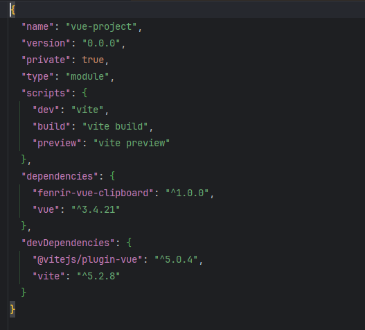
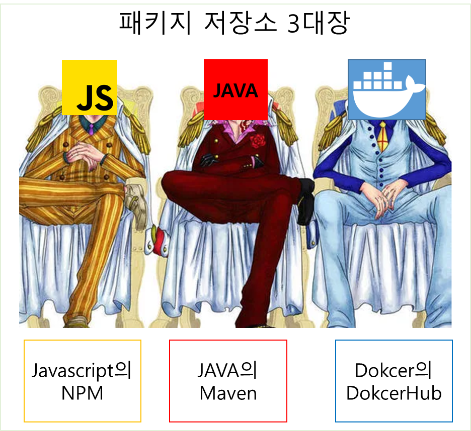
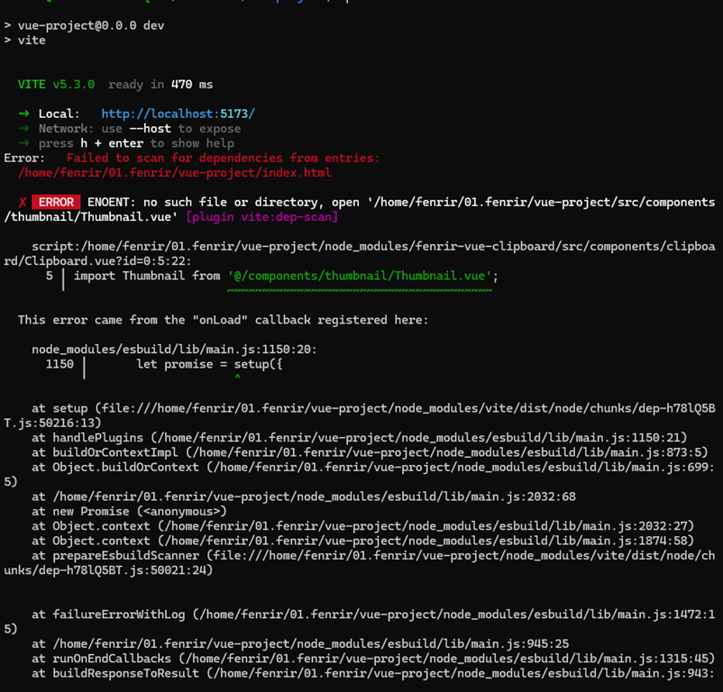

## 도입



현 회사에서 FE 개발자로 개발하면서 많은 페이지를 개발하고, 그 과정에서 공통적으로 사용하는 기능을 공통 컴포넌트로 만드는 작업을 했다.

이렇게 공통 컴포넌트들을 만들다 보니 문득 NPM에 내가 만든 컴포넌트를 올려보고 싶어졌고, 그 과정을 기록하려고 한다.

<!--truncate-->

## 본론

먼저, 내가 `이슈리포터`라는 프로젝트를 진행하면서, 많든 공통 컴포넌트 목록은 아래와 같다.

* 그리드
* 클립보드
* 인증/인가
* 스피너
* 트리 구조

이 컴포넌트 중에서 다른 패키지들과 의존성이 제일 낮은 클립보드를 `NPM 저장소`에 올려보려고 한다. 

### So, What is npm?

평소 개발하면서 프로젝트에 패키지, 라이브러리, 이미지 등을 사용하는데 이 때, 이러한 패키지를 가져오는 저장소가 있는데
javascript 사용하는 패키지 저장소가 **NPM**이다.



**NPM(Node Package Manager)** 은 JavaScript 언어를 위한 패키지 관리 도구로 Node.js 환경에서 서버 사이드 애플리케이션을 개발할 때 
주로 사용하지만, 프론트엔드 웹개발에서도 많이 사용된다.

**NPM**은 아래와 같은 주요 기능을 제공한다.
* 패키지 설치: 필요한 패키지를 쉽게 설치할 수 있습니다. 예를 들어, npm install lodash 명령을 실행하면 lodash라는 라이브러리를 프로젝트에 추가할 수 있습니다.
* 패키지 관리: 프로젝트에서 사용하는 모든 패키지를 한 곳에서 관리할 수 있습니다. package.json 파일은 프로젝트가 어떤 패키지에 의존하는지, 그리고 어떤 버전의 패키지를 사용하고 있는지에 대한 정보를 담고 있습니다.
* 패키지 게시: 자신이 작성한 코드를 패키지 형태로 만들고, NPM 공개 저장소에 게시하여 다른 개발자가 쉽게 사용할 수 있게 하는 기능도 제공합니다.

:::info
[NPM(Node Package Manager)](https://docs.npmjs.com/)
:::

평소에 설치, 관리 등은 이용하지만 한번도 **NPM**에 내가 만든 패키지를 업로드 해본적이 없어서 시도해 보려고 한다.

### 1. 기존 프로젝트에서 클립보드 소스 분리하기
먼저, vue cli로 프로젝트를 생성한다.

```shell
$ npm init vue@latest
```
생성된 프로젝트에 내가 개발한 컴포넌트를 붙어넣기 했다. 
그리고 `npm run dev` 명령어를 실행하자마자 내가 마주한 것은 수 많은 에러였다.


에러 내용으로는 내가 개발한 컴포넌트에서 다른 컴포넌트를 사용중인데 없고, 기존 프로젝트 개발 환경은 `vue:2.6.14`에 
`composition-api`를 추가해서 사용중이였으나, `vue cli`로 생성한 프로젝트는 `vue:3.x`를 사용한다. 

내가 개발한 컴포넌트는 처음부터 해당 프로젝트에서 사용한다고 생각하고 개발 했기 때문에 기 프로젝트에 엄청난 커플링이 되어있었다.

내 목표는 유연하고 범용성 높은 오픈소스를 만드는게 아닌 `NPM`에 업로드하고 인스톨 해서 사용해보자였기 때문에 
에러 나는 부분만 수정하는 작업을 진행 했다. 

> [수정한 소스 레파지토리](https://github.com/fenrirD/vue-clipboard/tree/master)

### 2. NPM에 패키지 만들기
패키지 만드는 방법

### 3. 배포하기
배포방법

### 4. 실제 사용해보기
실제 인스톨해서 사용한 이미지

## 결론

앞으로 NPM에 내가 만든 공통 컴포넌트들을 업로드 해야겠다는 느낌으로