## 도입

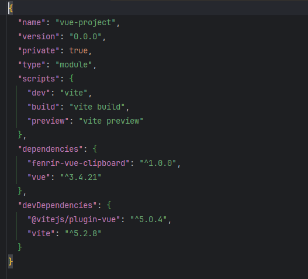

현 회사에서 FE 개발자로 개발하면서 많은 페이지를 개발하고, 그 과정에서 공통적으로 사용하는 기능을 공통 컴포넌트로 만드는 작업을 했다.

이렇게 공통 컴포넌트들을 만들다 보니 문득 NPM에 내가 만든 컴포넌트를 올려보고 싶어졌고, 이 포스트를 통해 그 과정을 기록하려고 한다.

<!--truncate-->

## 본론

먼저, 내가 `이슈리포터`라는 프로젝트를 진행하면서, 많든 공통 컴포넌트 목록은 아래와 같다.

* 그리드
* 클립보드
* 인증/인가
* 스피너
* 트리 구조

이 컴포넌트 중에서 다른 패키지들과 의존성이 제일 낮은 클립보드를 `NPM 저장소`에 올려보려고 한다. 

### So, What is npm?

평소 개발하면서 프로젝트에 패키지, 라이브러리, 이미지 등을 사용하는데 이 때, 이러한 패키지를 가져오는 저장소가 있는데
javascript 사용하는 패키지 저장소가 **NPM**이다.

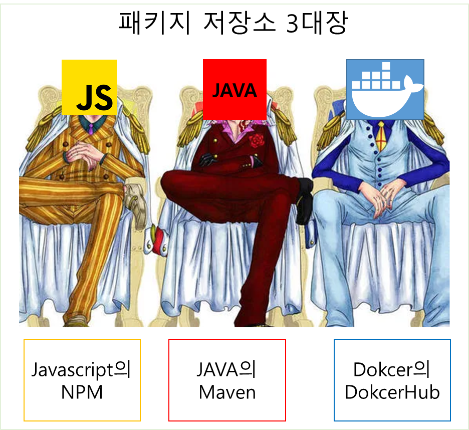

**NPM(Node Package Manager)** 은 JavaScript 언어를 위한 패키지 관리 도구로 Node.js 환경에서 서버 사이드 애플리케이션을 개발할 때 
주로 사용하지만, 프론트엔드 웹개발에서도 많이 사용된다.

**NPM**은 아래와 같은 주요 기능을 제공한다.
* 패키지 설치: 필요한 패키지를 쉽게 설치할 수 있습니다. 예를 들어, npm install lodash 명령을 실행하면 lodash라는 라이브러리를 프로젝트에 추가할 수 있습니다.
* 패키지 관리: 프로젝트에서 사용하는 모든 패키지를 한 곳에서 관리할 수 있습니다. package.json 파일은 프로젝트가 어떤 패키지에 의존하는지, 그리고 어떤 버전의 패키지를 사용하고 있는지에 대한 정보를 담고 있습니다.
* 패키지 게시: 자신이 작성한 코드를 패키지 형태로 만들고, NPM 공개 저장소에 게시하여 다른 개발자가 쉽게 사용할 수 있게 하는 기능도 제공합니다.

:::info
[NPM(Node Package Manager)](https://docs.npmjs.com/)
:::

평소에 설치, 관리 등은 이용하지만 한번도 **NPM**에 내가 만든 패키지를 업로드 해본적이 없어서 시도해 보려고 한다.

### 1. 기존 프로젝트에서 클립보드 소스 분리하기
먼저, vue cli로 프로젝트를 생성한다.

```shell
$ npm init vue@latest
```
생성된 프로젝트에 내가 개발한 컴포넌트를 붙어넣기 했다. 
그리고 `npm run dev` 명령어를 실행하자마자 내가 마주한 것은 수 많은 에러였다.
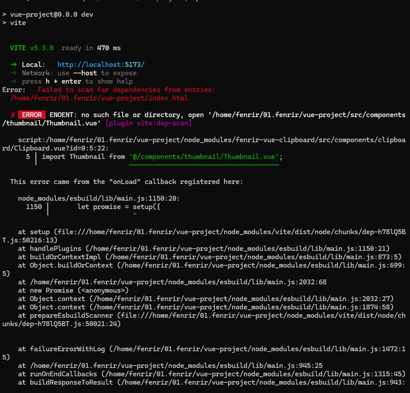

에러 내용으로는 내가 개발한 컴포넌트에서 다른 컴포넌트를 사용중인데 없고, 기존 프로젝트 개발 환경은 `vue:2.6.14`에 
`composition-api`를 추가해서 사용중이였으나, `vue cli`로 생성한 프로젝트는 `vue:3.x`를 사용한다. 

내가 개발한 컴포넌트는 처음부터 해당 프로젝트에서 사용한다고 생각하고 개발 했기 때문에 기 프로젝트에 엄청난 커플링이 되어있었다.

내 목표는 유연하고 범용성 높은 오픈소스를 만드는게 아닌 `NPM`에 업로드하고 인스톨 해서 사용해보자였기 때문에 
에러 나는 부분만 수정하는 작업을 진행 했다. 

> [수정한 소스 레파지토리](https://github.com/fenrirD/vue-clipboard/tree/master)

### 2. NPM에 패키지 업로드 하기

**NPM**에서 패키지를 다운로드만 받아보고, 패키지를 올려본적이 없던 나는 어떻게 업로드 해야하는지 부터 찾아봤고, 그 순서는 아래와 같다.


#### 1. NPM 가입하기
내가 관리하느 패키지를 업로드를 하려면 당연히 내 계정이 필요하다.
회원가입은 [NPM SignUp](https://www.npmjs.com/signup)에서 진행하면 된다.

:::info
https://docs.npmjs.com/creating-a-new-npm-user-account
:::

#### 2. 터미널에서 로그인하기
먼저 로컬에 있는 소스를 **NPM** 저장소에 올려야 하므로 로컬 로컬 터미널 환경에서 로그인이 잘 되는지 확인을 해주는 과정이다.

```shell
$ npm login

npm WARN adduser `adduser` will be split into `login` and `register` in a future version. `adduser` will become an alias of `register`. `login` (currently an alias) will become its own command.
npm notice Log in on https://registry.npmjs.org/
Username: fenrir93
Password:
Email: (this IS public) fenrir4504@gmail.com
npm notice Please check your email for a one-time password (OTP)
Enter one-time password: 
Logged in as fenrir93 on https://registry.npmjs.org/.

```
로그인 명령어를 치게 되면 가입한 계정으로 로그인 할 수 있다. 

> 만약 로그인을 안하고 진행하게 되면 403에러가 발생한다.
> 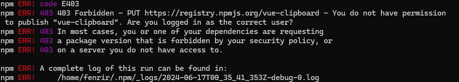

#### 3. package.json 작성하기
나는 앞에서 `vue cli`로 프로젝트를 생성해서 `npm init` 명령어를 통해 `package.json`을 별로로 생성할 필요는 없었지만 파일이 없다면
`npm init`으로 `package.json`을 생성해줘야 한다.

**npm**에 패키지를 배포하기 위해서는 필수적으로 들어가야하는 값들이 존재하는데 다음과 같다.

```json
{
  "name": "your-package-name", // 패키지의 이름. npm 레지스트리에 고유해야 합니다.
  "version": "1.0.0", // 패키지의 현재 버전. SemVer(유의적 버전) 형식을 따릅니다.
  "description": "Description of your package", // 패키지에 대한 간략한 설명.
  "main": "index.js", // 패키지가 호출될 때 기본으로 로드되는 모듈의 진입점.
  "scripts": { }, // 패키지 스크립트. 공백일 수 있지만 주로 "start", "test" 등의 스크립트를 포함합니다.
  "keywords": [], // 패키지에 관련된 키워드의 배열. 검색 엔진 최적화와 패키지 검색을 도와줍니다.
  "author": "Your Name <your.email@example.com> (Your website)", // 패키지 작성자의 정보.
  "license": "ISC" // 패키지에 적용된 라이선스. 일반적으로 "MIT"나 "ISC" 등의 공개 소프트웨어 라이선스를 사용합니다.
  "repository": {
    "type": "git",
    "url": "git+https://github.com/${UserName}/${RepoName}.git"
  } // 소스가 관리되는 저장소
}
``` 
그리고 위 정보를 바탕으로 `package.json`에 적용했다.
```json
{
  "name": "vue-clipboard",
  "version": "1.0.1",
  "description": "vue clipboard, thumbnail",
  "private": false,
  "type": "module",
  "scripts": {},
  "dependencies": {},
  "repository": {
    "type": "git",
    "url": "git+https://github.com/fenrirD/vue-clipboard.git"
  },
  "keywords": [
    "Vue.js"
  ],
  "author": "fenrir93",
  "devDependencies": {}
}


```

#### 3. 배포하기

`package.json`을 다 작성 했다면 이제 **NPM**에 배포만 남았다. 배포는 배포할 프로젝트 경로에서 `npm publish`만 해주면 된다.

```shell
$ npm publish
```

༼ つ ◕_◕ ༽つ(두근두근두근)

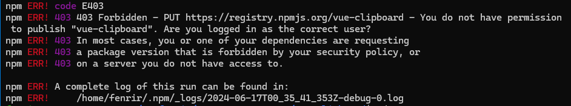

.... 왜 또 403에러 일까 하고 봤더니 현재 터미널에 로그인한 유저가 **"vue-clipboard"** 에 대한 권한이 없다는 것이다.
**(╯°□°）╯︵ ┻━┻**

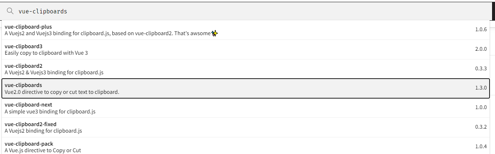

그래서 찾아 봤더니 이미 **"vue-clipboard"**라는 이름의 패키지가 존재했다. 그래서 **"fenrir-vue-clipboard"**로 냅다 변경했다.

다시 `npm publish` 를 입력한 결과 아래와 같이 성공 했다.

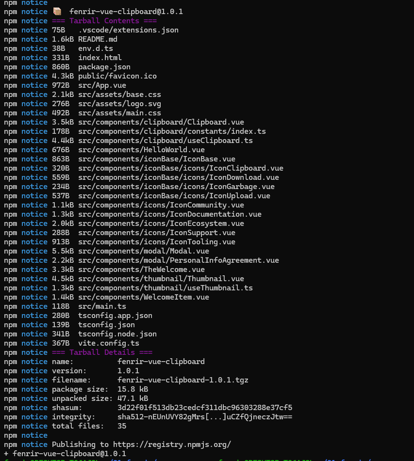

> NPM 패키지에 당당히 올라간 내 패키지
> 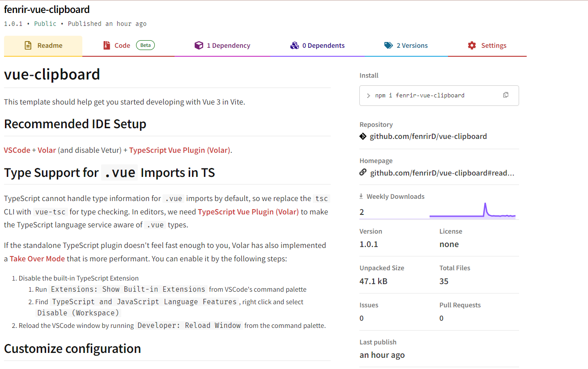

:::info
[내가 만든 Package](https://www.npmjs.com/package/fenrir-vue-clipboard)
:::

### 4. 설치 및 사용

**NPN** 저장소에도 당당히 올라간 내 패키지를 설치하고, 사용해보기 위해서 새로운 프로젝트를 만들고 인스톨을 해봤다.

```shell
$ npm install fenrir-vue-clipboard
```
> 정상적으로 설치된 내 패키지!
> 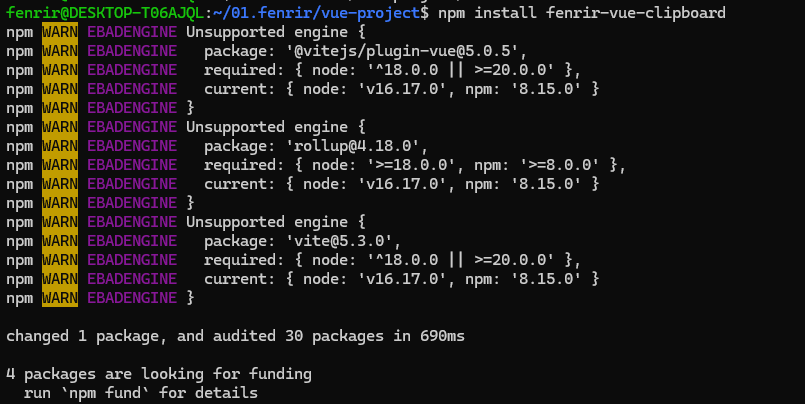

패키지도 정상적으로 설치되고, 기분이 좋아진 나는 힘차게 프로젝트를 실행했다.

하지만....

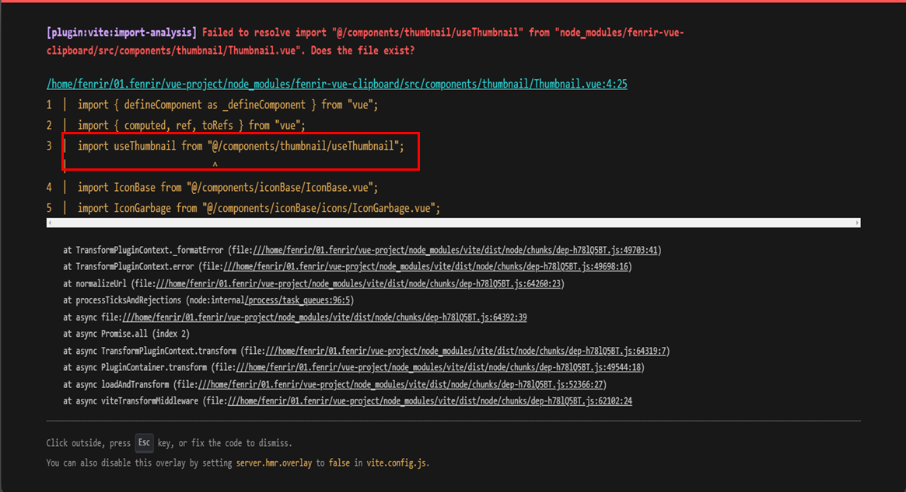

경로를 못찾는 에러가 발생했다. 흐음. 그래서 찾아보니 **NPM**에 배포한 패키지는 `alias` 설정을 해주려면 별도 라이브러리르 다운로드 해서
따로 설정이 필요한거 같다. 그래서 나는 일단 상대 경로로 변경을 해주는 작업을 했다.

그리고 다른 오류가 발생하면 안되니까 배포하기전에 테스트를 먼저 진행했다. 테스트 방법은 아래와 같다

```shell
$ npm install 패키지 경로
```
위 명령어를 테스트할 프로젝트에서 실행하면 `packae.json`이 아래와 같이 변경된다.

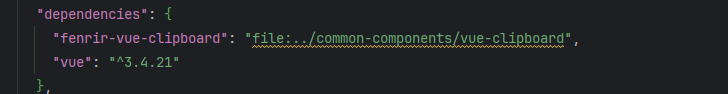

이제 다시 실행 프로젝트를 실행하면 정상적으로 실행이 되고, 내 컴포넌트의 기능이 정상적으로 동작하는지 테스트 할 수 있다.
실행한 프로젝트에서 테스트 결과 정상적으로 동작을 하였고, 버전을 올려서 배포를 다시 진행했다.

그리고 다시 설치를 하고, 동작 결과 **(\*/ω＼\*)**

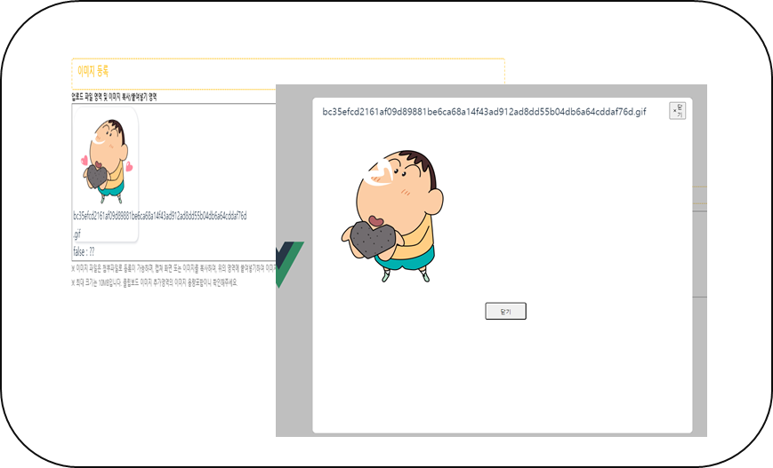

내가 구현한 기능들이 정상적으로 동작이 됐다.

## 결론

내가 만든 패키지는 `vue 3.x.x`에서만 동작하고, `props`도 다양하지 못해서 범용성, 확정성, 유연성 등의 모든 점에서 이걸 과연 누가 쓸까?
라고 생각이 든다. 

하지만 처음 패키지를 올릴 때, 내 목표는 일단 올리고, 사용해보자가 목표 였으므로 내 목표는 달성 했다.


앞으로는 내가 회사에서 만든 공통 컴포넌트를 좀 더 유연하고 확정성 높게 설계해서 **NPM**에 올리는걸 목표로 개발을 해야겠다.

