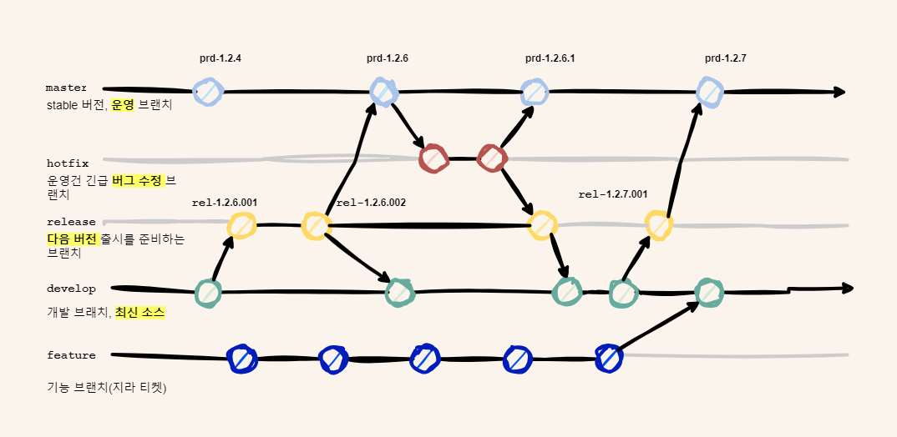

import BrowserWindow from '@site/src/components/BrowserWindow';

## 도입

어느 무더운 날, 팀장님이 팀원들을 회의실로 소집했다.

> 개발팀 어셈블!

그 이유는 운영 중인 서비스와 앞으로 개발 할 서비스의 서버를 분리하자고 하셨고, 
FE 개발과 DevOps 직무를 병행하고 있는 나는 새로운 환경을 구성했다.

새로운 환경을 구성하고 보니... 새로운 브랜치 전략이 필요하다는 생각이 들었다.

<!--truncate-->

## 본론

### GIT 브랜치 전략 필요성

프로젝트 초창기에는 운영 중인 환경이 없으니 `develop`에서 파생된 `feature` 브랜치에서 각 개발자들이 개발을 하고 `develop`에 머지 후 검증하고
`master`에 반영하여 배포 하는 방식으로 개발을 진행했다. (배포 할 때 마다 태그를 생성)

:::tip
위 방법을 `Github Flow` 전략이라고 한다.
:::

하지만 어느 순간 프로젝트가 오픈을 하게 되고, 운영 중인 버전(v1.x)와 앞으로 개발 할 (v2.x) 를 동시에 관리가 필요하고, 각 기능 마다 배포시기가
달라서 기존의 브랜치 전략을 사용한다면 엄청난 혼란에 빠지고, 배포 할 때 마다 피로도가 누적 될거라고 생각이 들었다.

> 운영중인 v1.x.x 와 새로 개발하는 v2.x.x 에서 생겨난 문제

그리고 이런 피로도는 곧 개발자들의 생산성 저하에 직결된다.

> 혼란하면 혼세마왕이 도래한다...

### GIT 브랜치 전략이란?
GIT 브랜치 전략은 소프트웨어 개발 과정에서 브랜치를 효과적으로 관리하고 사용하는 방법을 정의한 것으로 브랜치 전략은 코드의 안정성, 협업 효율성, 그리고 배포 프로세스를 향상시키기 위해 매우 중요하다고 한다

> ChatGPT Official

#### 유명한 브랜치 전략

* Git Flow
  * 긴 수명의 브랜치('main', 'develop')와 짧은 수명의 브랜치('feature', 'release', 'hotfix')를 사용하여 코드 변경을 관리. 주로 대규모 프로젝트에서 사용되며, 명확한 구조와 프로세스를 제공
* GitHub Flow
  * 간단하고 효율적이며, 지속적인 배포(CD)를 지원.
  * main 브랜치에서 파생된 짧은 수명의 feature 브랜치를 중심으로 작업.
* GitLab Flow
  * GitHub Flow처럼 단순하지만, 추가적인 브랜치를 활용해 다양한 환경(예: staging, production)을 지원.
* Trunk-Based Development
  * main 브랜치가 유일한 장기 브랜치로, 모든 변경이 여기에 병합.
  * 짧은 수명의 브랜치만 생성하며, 빠르게 병합 후 삭제.

### 선택

나는 다른 개발자들이 방심 했을 때, `Git Flow` 전략을 사용하기로 했다.
`Git Flow` 선택 이유는 기존 서버가 1개에서 2개로 분리되면서 운영 브랜치와 개발 브랜치를 나눠야하고, 다른 브랜치 전략은 모두 하나의 
브랜치를 중심으로 피쳐를 파생하고, 그 브랜치가 항상 최신 소소지만 우리는 v1.x.x와 v2.x.x가 동시 개발한다는 점과 그리고 해보고 안되면 
말지라는 생각으로 선택하게 되었다.

> 개발자 1분은 인병 휴가 상태고, 다른 한 분은 다른 프로젝트 지원 중 이였다.

그리고 FE 개발자들을 설득하기 위해 그림을 그렸다.

### 브랜치 정의

`Git Flow` 전략에 맞게 각 브랜치는 사용 목적이 있는데 아래와 같다.

* `master`
  * 안정적인 코드 베이스
  * 내부망 개발, 운영에 반입된 소스
  * 태그는 prd-x.x.x
* `release`
  * 배포 준비가 완료된 버전의 코드
  * 지라의 릴리스 기준으로 브랜치가 생성됨
  * 개발 서버에 반영 됨
  * 기획자 검수가 끝나고, 정기 배포날에 master 브랜치로 반영
* `develop`
  * 다음 출시될 버전의 통합 브랜치
  * 항상 최신 소스를 갖고 있음
* `feature`
  * 새로운 기능을 개발하기 위한 브랜치
  * feature에서 개발 후, develop과 해당하는 릴리즈 버전에 반영 할 것
  * feautre 브랜치 생성시에 규칙은 feat/JIRA-TICKET OR feat/기능 으로 한다.
* `hotfix`
  * 배포 버전에서 발생한 긴급 문제 해결

각 브랜치들의 목적을 설명하고 위 그림을 보면서 팀원들과 논의를 해서 `Git Flow` 전략을 사용하자고 동의를 얻었다.

#### 논의 중 나온 질문과 답변

<BrowserWindow>

Q. 이 전략이 필요한 이유가 뭐에요?

A. V2.0.1에 반영될 기능 A와 V2.0.2에 반영될 기능 B가 있을 때, 기존 방식대로라면 검수를 받기 위해 이 기능 모두 develop 브랜치에 머지가 될거고
그러면 실제 V2.0.1 배포 때 develop 브랜치에서 이 기능만 가져오기가 복잡할것이다. 애초에 버전별 release 브랜치를 생성하고, develop 에 반영 후 검수 받고,
검수 받은 후, 각 release에 반영하면 배포 날에는 해당 release 브랜치 기준으로 master에 머지하면 배포 날에 혼란이 줄어든다고 생각한다.

Q. 적응하는데 쉽지 않을거 같다.

A. 초기에는 귀찮고 힘들거라고 생각한다. 하지만 인간은 적응의 동물이다.

Q. 맛있는 빵집은?

A. 베통 소금빵 맛있다. 🤭

</BrowserWindow>

## 결론

Git Flow 전략을 사용한 지 3개월이 지났다. 
초기 2주 정도는 많은 시행착오가 있었지만 지금은 모두 규칙에 따라서 잘 운영되고 있다. 아마 초창기에 고생은 좀 했지만 이렇게 전략을 정하지 않고 개발을 했다면 배포할 때마다 더 고생을 했을 거라고 생각한다.

어떤 브랜치 전략이든 정답은 없고 각 상황에 맞게 브랜치 전략을 사용하면 보다 생산성을 높이고 효율적으로 프로젝트를 운영할 수 있다고 생각한다.

그리고 DevOps 역할을 하면서 늘 생각하는 거지만 어떻게 하면 보다 생산성을 높이고, 팀원들을 편하게 해줄까 고민하면서 내가 느끼는 고통은 크지만 내가 구현한 방식대로 잘 운영되고 좋은 피드백을 받을 때마다 기분이 좋다. 특히 Git Flow 도입 후 배포 과정이 안정화되고 팀 협업이 원활해지는 걸 보면서 DevOps의 매력에 푹 빠졌달까?

이런 경험을 바탕으로 helm, terraform 등 다른 것도 공부하려고 한다. 아마 이것들도 도입하면 처음엔 팀원들이 투덜거리겠지만, 결국엔 "야 이거 좋네?"라고 말할 날을 기대하며...

