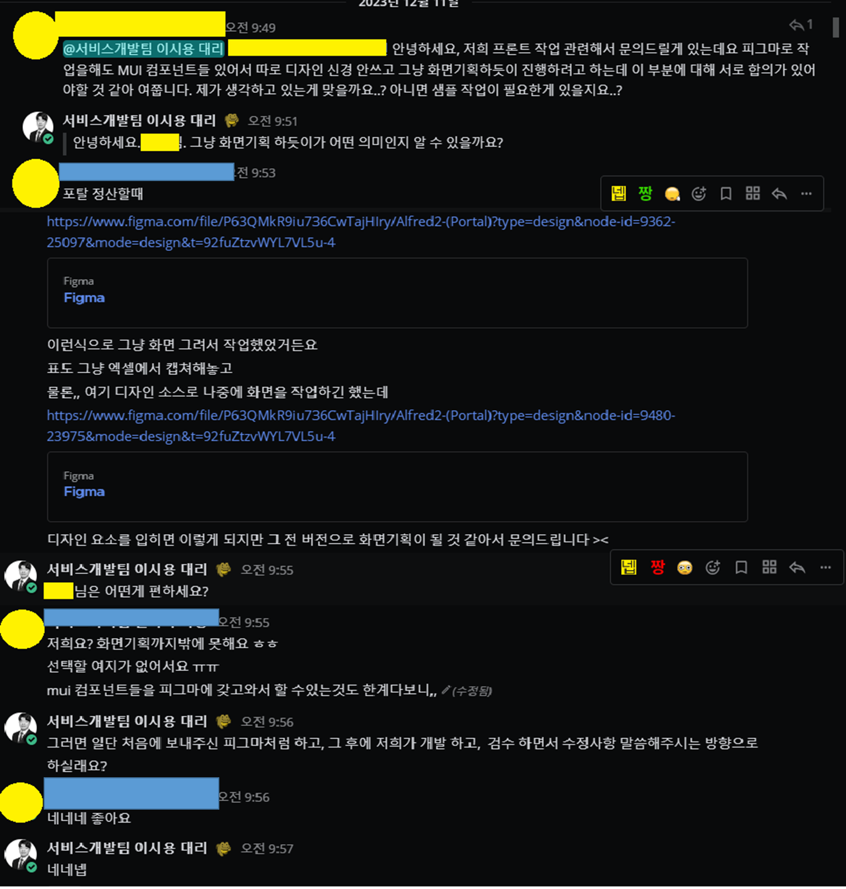

## 도입

24년 시작과 동시에 나는 새롭게 시작하는 프로젝트에서 프론트엔드 리드 개발자 역할을 수행하게 되었다.

그리고 늘 그렇듯 프로젝트가 마무리 되어가는 시점에서 24년에 대해 회고를 해보자고 한다.

<!--truncate-->

## 본론

내가 24년에 한 업무를 나열해보면 아래와 같다.
* MSP Portal 프론트엔드 리드 개발
* MSP Portal 프론트엔드 개발, 운영 서버 구성
* MSP Portal CI/CD 구성 및 작성
* ChatbotUI 설치 및 스터디

> 이슈리포터 트러블슈팅을 살짝 곁들인~

### 프론트엔드 리드 개발

24년에는 나는 **MSP Portal** 프로젝트를 전담으로 수행했다.

#### 프로젝트 배경

먼저 프로젝트를 설명 하면 프로젝트명은 **MSP Portal**로 현 회사에서 멀티 CSP 를 관리하고, CSP 비용과 CSP 관리 비용을 고객에게
청구하기 위해 손으로 작업하던 업무를 시스템화 시켜주는 프로젝트로 프로젝트의 목표는 기존에 사용하던 사이트를 이관하고 리뉴얼하며 새로운 기능 추가였다.

#### 프론트엔드 아키텍처 설계

처음 현 회사에 왔을 때 동일한 페이지에서 사용하는 동일한 패턴을 분석해서 공통 컴포넌트화 시켜서 팀원들에게 한번 사용해보라고 설득하고, 팀원들의 피드백을 받았을 때도 기분이 엄청 좋았는데 
이번에는 내가 모든 기술 스택을 정하다니 ( 물론 팀원들과 상의 해서 정함) 그에 따른 책임도 있으니 적당히 신나고 적당히 부담스러웠다.

내가 프론트엔드 리드 개발자로서 가장 중요하게 생각한 점은 아래와 같다.

1. 통일성 있는 UI/UX
2. 오픈소스 활용
3. 코드 재사용성
4. 유지보수를 고려한 개발

##### 일관적인 UI/UX

현 회사에서 UI 작업 방식은 기획자가 컨플루언스(이하 컨플)에 기능을 정의하고, 피그마에 UI 작업을 하면 개발자가 개발을 하는 방식이였고, 작업하는 개발자마다 조금씩 달라서 일관성 있는 UI가 아니였다. 
그리고 사정상 디자인보다 개발이 먼저 진행되는 상황이여서 개발자들이 러프하게 개발을하고 기획자들이 후 기획을 해야하는 상황이 였다.
그래서 나는 Material Design 기반의 오픈소스인 MUI 사용하여 개발하자고, 팀원들과 기획자에게 MUI를 사용하여 공통적으로 사용하는 
컴포넌트들의 개발의 다지인을 최소화하고, 후에 config 를 통해 커스텀(KB스러운)이 쉽다는 점을 강력하게 어필했고, 모두가 동의해서 사용할 수 있었다.

하지만 선택에는 책임이 따르고 나는 보다 원할한 협업을 위해 각 컴포넌트 샘플페이지를 제작해서 기획자, 팀원들에게 제공하는 방식으로 개발을 진행했다. 




결과적으로는 모든 페이지에서 동일한 컴포넌트를 사용해서 화면 검수 후 수정 시간도 대폭으로 감소했다.


:::info
기획자분들에게 동료 친찬 포인트를 받았다.!
:::

##### 오픈소스 활용

나는 기능을 구현하기전에 항상 전 직장 이사님이 하신 말씀을 떠올린다.

> **"하나하나 다 만들려고 하지말고, 이미 만들어진걸 가져와서 사용해라"**

초기에는 이게 무슨 말씀이신지 이해를 못했고, 속으로 "아니 다 갖다 쓰면 개발자는 뭐 먹고 사나?" 라고 생각을 했다. 
지금의 나는 오픈 소스를 활용해서 일반적인 기능은 오픈소스를 활용하고 커스텀이 필요한 부분을 커스텀하여 개발생산성을 높이라는(물론 돈을 안쓰고) 의미라고 생각한다.

그래서 이번 프로젝트에서도 기능정의를 보고 공통된 특징인 정보성 데이터를 표출하고 사용자와 상호작용하는 데이터, 그리고 게시판 에디터 기능을 구현하기 위해
오픈 소스 `x-data-grid`, `tinymce editor` 사용했다. (물론 오픈소스가 내가 원하는 기능을 다 제공하지는 않으니 약간의 커스텀을 곁들인)

결과적으로 우리 서비스에만 필요로 하는 기능을 커스텀하는 과정은 지옥이였지만 모두가 만족하는 오픈소스+커스텀 기능을 구현했다.

:::info
우리가 필요로하는 기능은 유료다.😂
:::

##### 코드 재사용성 & 유지보수를 고려한 개발

어떤 프로젝트를 하던 고민하는 부분이다. 코드를 재사용해서 유지보수를 더욱 쉽게하는걸 꿈꾼다. 그래서 나는 공통으로 사용하는 기능 및 컴포넌트들은
공통 컴포넌트로 설계를 한다.  
```
.
├── common
│   ├── AlertDialog
│   ├── AuthButton
│   ├── Board
│   ├── Button
│   ├── Card
│   ├── CurrencyUnitLabel
│   ├── CustomCodeBlock
│   ├── Dialog
│   ├── ErrorBoundary
│   ├── Excel
│   ├── GridDS
│   ├── GridDSWrapper
│   ├── HighlightText
│   ├── Icon
│   ├── Invoice
│   ├── MultiSelect
│   ├── Notification
│   ├── ScrollTop
│   ├── SearchArea
│   ├── Tab
│   ├── TableOfContents
│   ├── Title
... 생략...
```
하지만 공통 컴포넌트를 만들고 공유하는 과정에서 생각보다 특정 페이지에 의존하게되는 컴포넌트들이 나오곤 한다. 
어떻게 하면 응집도와 결합도를 낮출까 고민하는 과정이 즐거우면서도 고통스럽다. 그리고 동료들의 피드백은 따갑다.

그래도 내가 만든 공통컴포넌가 긍정적인 피드백이 오면 그 기끔은 말로 할수 없다.
 
### 프론트엔드 개발, 운영 서버 구성

우리 팀은 기존에는 백엔드 개발자가 개발,운영 서버를 구성 했지만 내가 입사하고 프론트엔드에 대한 환경은 내가 구성을 담당하게 되었다.
처음에는 쿠버네티스의 `apply`,`delete`만 할 줄 알던 내가 요즘에는 하나의 `pod`를 구성하기 위한 k8s manifest 파일들을 작성하고 관리한다.

그리고 특이한게 어느 순간 그 과정 마저 귀찮아서 helm으로 차트를 만들었다. 아직 전반적인 인프라 환경에는 약하지만 더 관심이 생기고 있다.

### MSP Portal CI/CD 구성 및 작성

이 프로젝트에서 CI/CD는 정보보호심의를 받기 전과 받은 후로 나뉜다. 회사 특성상 개발은 외부망에서 하고, 운영은 폐쇄망에서 하는 환경인데 외부-폐쇄에서 파일을 전송할 때는 특정 프로그램을 이용해야 한다.
하지만 이게 상당히 귀찮은 작업이라서 정보보호심의를 받기 전에는 `Git Push - Jenkins Build(yarn offline mirro) - AWS S3 Push - Git pull - Jenkins build - k8s apply` 하는 방식의 CI/CD를 구성했다.

그리고 정보보호심의를 받은 후에는 AWS S3를 이용 할 수없으니 `S3 Push` 과정에서 프로그램으로 빌드된 소스를 갖고 들어가는 방식으로 수정했다.


### ChatbotUI 설치 및 스터디

연말에는 팀장님이 ChatbotUI를 우리 서버 환경에 구성해서 커스텀 해보자고 하셨다. 그래서 ChatbotUI를 구성하는 `supabase`,`ollama` 등을 공부해서 우리가 갖고 있는 인프라 환경에 실행했다.
그리고 `next.js`로 구성된 ChatbotUI를 커스텀하여 MSP Portal의 API를 이용해서 질의를 주고 받을 수 있게 개발 했다.

AI에 대한 지식이 없어서 많이 해맸지만 팀장님의 서포트와 공식 도큐먼트 덕분에 어찌어찌 개발은 했다. 기회가 된다면 더 집중해서 개발해보고 싶다.

:::info
https://www.chatbotui.com/ko
:::

## 결론


### 24년 Best
아무래도 처음으로 프론트엔드 리드 개발자 역할을 성공적으로 끝낸게 가장 만족스럽다. 오픈소스를 커스텀, 공통컴포넌트, 등 개발 생산성을 증가시키고, 팀원들이 개발에만
집중할수 있게 CI/CD를 구성하고, k8s도 역량도 좀 더 키울수 있어서 만족한다.


### 24년 Worst
팀원들의 부상? 등오로 2개월 동안 혼자 개발한 시간이 있었는데 이때 좀 예민했던거 같다. 그러다보니 프로젝트의 퀄리트를 높이기보다는 빠르게 쳐내는거에 집중하던 시기였다.
그 어떤 상황에서도 흔들리지않는 멘탈을 가지고 유연한 사고를 할 수 있도록 노력해야겠다.

### 회고
나는 지금 생각해보면 24년에는 팀장님의 지지를 받아 내가 해보고 싶은건 다 해본 한 해 인거 같다. 프론트엔드 리드 개발자, CI/CD 구성, AI 관련 오픈소스 모두 팀장님이 믿어주신 덕분 아니였을까? ㅎㅎ

아직도 내가 모르는 분야가 많고, 더 공부를 해야하는데 너무 귀찮고 힘들다. 그래도 팀장님 덕분에 AI에 대해 조금은 이해했다. AI가 내 일자리를 뺏어가기 전에 내가 AI를 다룰수 있도록 더 공부해야겠다.
그리고 FE 뿐만아니라 다시 BE 공부도 해야한다고 생각한다.(요즘은 FE로만 밥 벌어 먹을 수 있을가에 대한 고민이 많다.)


